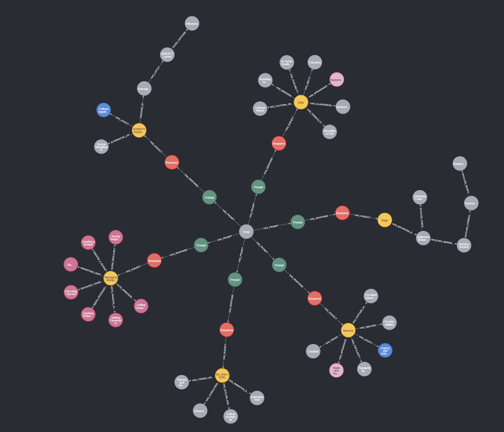

# nlp_server
NLP server housing intent and NER models as well as Langchain memory agent for Ditto [assistant](http://github.com/omarzanji/assistant) clients.

## Running Locally with Docker 
1. Rename `.env.example` to `.env` and set `OPENAI_API_KEY` to your OpenAI API key.
2. Rename `example_users.json` to `users.json` and add user's information.
3. `docker build -t nlp_server .`
4. `docker run --env-file .env --rm -p 32032:32032 nlp_server`

## Set up Google Search API for LLM (optional)
1. Main Google Search Agent:
    1. Create an account on [serpapi.com](http://serpapi.com/) and set `SERPAPI_API_KEY` to your API key in `.env`.
2. Fallback Agent: 
    1. Create an account on [serper.dev](http://serper.dev/) and set `SERPER_API_KEY` to your API key in `.env`.

## Changing LLM Provider
1. If you prefer using HuggingFace's API, set `HUGGINGFACEHUB_API_TOKEN` to your HuggingFace API key and set `LLM=huggingface` in `.env`.

# Visualizing Memory
1. Install [Neo4j Desktop](https://neo4j.com/download/) and create a new project.
2. Add a new database named `ditto-memory` and set the password to `password`.
3. That's it! You can now visualize the memory by opening the Neo4j browser and running the following query:
```cypher
MATCH (n) RETURN n LIMIT 100
```

## Memory Visualization in Neo4j Example


All nodes can be expanded to view their properties. Each node holds textual information in the `description` property. The following are the types of nodes in the graph and what their description properties hold:

1. Prompt Nodes: holds a summary of the user's prompt in `description`.
2. Response Nodes: holds a summary of Ditto's response in `description`.
3. Subject Nodes: holds the subject name of the conversation pair in `title` and `description` (same as `title` for Subject Nodes).
4. Sub-category Nodes: holds a summary of each sub-category in Ditto's response, where each sub-category node holds a summary of the sub-category in `description`.

